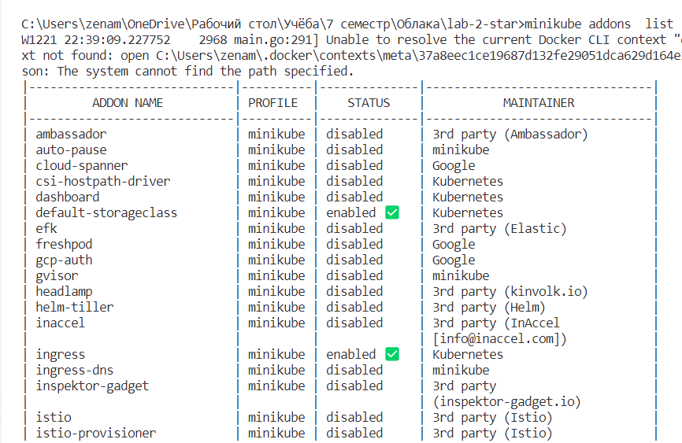
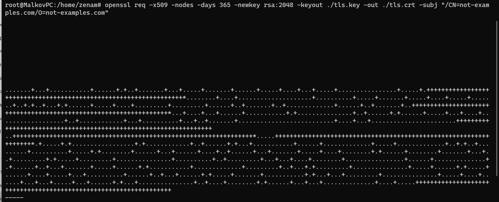
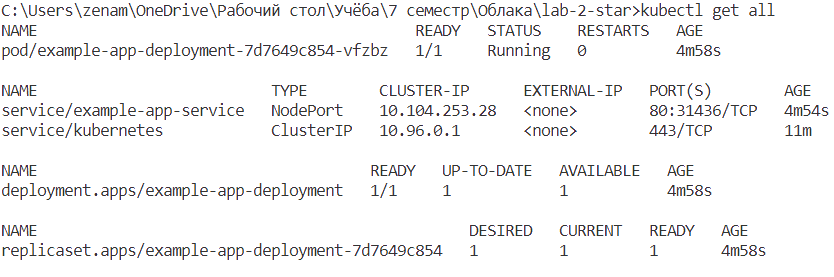
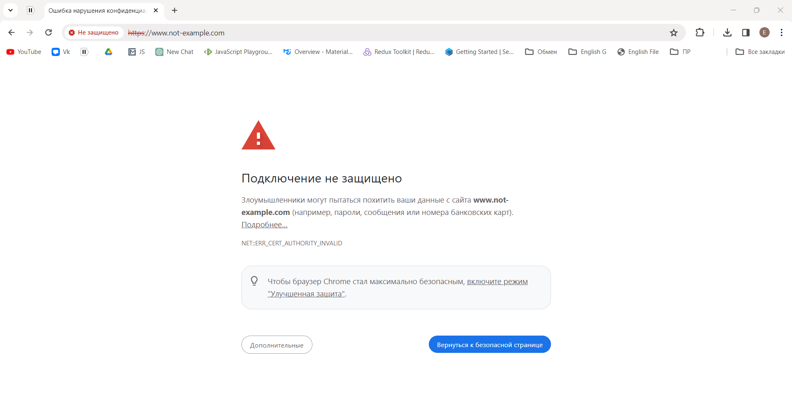
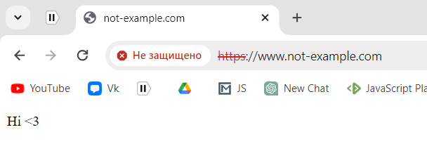
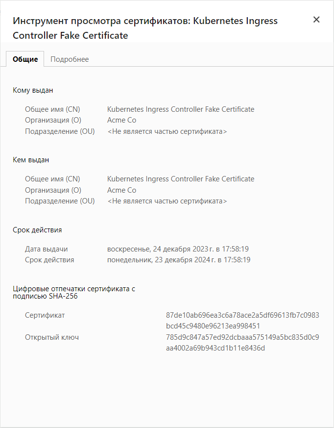

# Лабораторная работа №2\*. Настройка подключения к сервису по HTTPS с помощью самоподписанного сертификата

## Цель работы

Настроить подключение к сервису по HTTPS с помощью самоподписанного сертификата.

## Ход работы

Для начала установим ingress-addon для minikube с помощью команды `minikube addons enable ingress`. Ingress - это хороший встроенный аддон для миникуба, помогающий управлять маршрутизацией с помощью nginx. Проверим, что ingress включен с помощью команды `minikube addons list`:

<p align="center">
    
</p>

Далее настроим доменное имя для нашего сервиса. Для этого добавим в файл hosts запись. В качестве ip-адреса возьмем ip-адрес minikube, который можно получить с помощью команды `minikube ip`:

```
192.168.59.100 www.not-examples.com
```

Таким образом запросы на домен not-examples.com будут перенаправляться на ip-адрес minikube.

Далее создадим 4 файла ресурсов для нашего приложения:

- deployment.yaml - содержит описание pod-ов, которые будут созданы;
- service.yaml - содержит описание сервиса, который будет создан. Сервис будет иметь тип NodePort, что позволит обращаться к нему снаружи кластера;
- ingress.yaml - содержит описание ingress-а, который будет создан.
- secret.yaml - содержит описание secret-а, который будет создан. Secret будет содержать сертификат и ключ для нашего домена.

Конфигурация deployment.yaml:

```yaml
apiVersion: apps/v1
kind: Deployment
metadata:
  name: example-app-deployment
spec:
  replicas: 1
  selector:
    matchLabels:
      app: example-app
  template:
    metadata:
      labels:
        app: example-app
    spec:
      containers:
        - name: example-app-container
          image: duglas431/example-app:1.0
          resources:
            limits:
              memory: "1024Mi"
              cpu: "500m"
          ports:
            - containerPort: 3000
```

Конфигурация service.yaml:

```yaml
apiVersion: v1
kind: Service
metadata:
  name: example-app-service
spec:
  type: NodePort
  selector:
    app: example-app
  ports:
    - protocol: TCP
      port: 80
      targetPort: 3000
```

Конфигурация ingress.yaml:

```yaml
apiVersion: networking.k8s.io/v1
kind: Ingress
metadata:
  name: example-app-ingress
spec:
  tls:
    - hosts:
        - www.not-example.com
      secretName: self-signed-secret
  rules:
    - host: www.not-example.com
      http:
        paths:
          - path: /
            pathType: Prefix
            backend:
              service:
                name: example-app-service
                port:
                  number: 80
```

Конфигурация secret.yaml:

```yaml
apiVersion: v1
kind: Secret
metadata:
  name: self-signed-secret
data:
  tls.crt: |-
    LS0tLS1CRUdJTiBDRVJUSUZJQ0FURS0tLS0tCk1JSURUVENDQWpXZ0F3SUJBZ0lVUmdlYkFxK2JV
    dktsdyt2VnhhQ3VGRjRwRHd3d0RRWUpLb1pJaHZjTkFRRUwKQlFBd05qRVpNQmNHQTFVRUF3d1Fi
    bTkwTFdWNFlXMXdiR1Z6TG1OdmJURVpNQmNHQTFVRUNnd1FibTkwTFdWNApZVzF3YkdWekxtTnZi
    VEFlRncweU16RXlNakV4T1RNM01qbGFGdzB5TkRFeU1qQXhPVE0zTWpsYU1EWXhHVEFYCkJnTlZC
    QU1NRUc1dmRDMWxlR0Z0Y0d4bGN5NWpiMjB4R1RBWEJnTlZCQW9NRUc1dmRDMWxlR0Z0Y0d4bGN5
    NWoKYjIwd2dnRWlNQTBHQ1NxR1NJYjNEUUVCQVFVQUE0SUJEd0F3Z2dFS0FvSUJBUUM2VzRnYk1Q
    am02WWlTWCs0KwpkWHA1UDROc3YxOGx5RmtXaFE1U3U1and5cnFUOTQzSmxOdE5icjdwYWo4cktP
    MWgzdHIvRThRdkEvbFh4SzZVCm5DMm0rbG05Y01ZOWo4elRaQWF0L2VuYXdOcm9EeS9jWDV5aTY4
    ZVIvYU01NTdndnRBNUFKMUdEUGJLUE84dlUKeVUremc4UnpPNGt6QklMN2VFYndkUEQ4SXIzRG5r
    WlNQRkcydXFWbGR1RFI2aFdiTjJ6NEF6K3d0aWxQay8xUwo3YjJzZEkwWk02bFA2N2J2d2xESkQ3
    WEo0U1p3dVJiTXowSzRHdWI0Q1NUZkV1eG5FV1NpQS9wL0hLeExHRnRUCkZTTXNaS2kyaVIrc3Rq
    L2UxeG14dXlRSVVnYkQrVXVzdDhXeERPTGRGNzh3ck1aUHV0bnYwb1JaNFV0bCtKbnoKZEdtNUFn
    TUJBQUdqVXpCUk1CMEdBMVVkRGdRV0JCU0tza1dsU2MyT0hnV0c4OUlFeXhweitUSWUrVEFmQmdO
    VgpIU01FR0RBV2dCU0tza1dsU2MyT0hnV0c4OUlFeXhweitUSWUrVEFQQmdOVkhSTUJBZjhFQlRB
    REFRSC9NQTBHCkNTcUdTSWIzRFFFQkN3VUFBNElCQVFBUzdxTG83b24vYm1wemFTWWF4ZFdoblBS
    NTFBdmpsQm1CRXo0OG5ZVmYKNWNkMzNZVkRMVzNSUXd3VGtRTUxjTVdUcndOQytqbHJjNnRCNzV2
    MHp2UW0zR1FCK3NQQUV4LzVBZjJ2MFhWNApncTlGYjJpYjgzMTVlYTZLaHRUVTJ0SkZvQ1NaZTVH
    U1BrdUFPc2t6dWRyOWo0OW14UG56d1ZBRDg4MGt2c3hqClFLZUFiYmdWVzdjK0ZkdEpZM1RYTW10
    TVpMKzFyaWthTE9qUWhjMTVDdGFDQk94Qy9HY2dpMXByR1ZGZXd4OFAKTW82aVRvb0ZLWE1aM29s
    b2YyTG9sT1ZycXpZMmJ6RURicEhMOFZiTlhhWXhiWk5ZSzlDc3NJZ0pOQUdEbG1zOQpobEYvUVF2
    NEJPajJKVm9VZlFTM0pDN1BuUzBFNWRqUzVETy9pazdzZkRnVwotLS0tLUVORCBDRVJUSUZJQ0FU
    RS0tLS0tCg==
  tls.key: |-
    LS0tLS1CRUdJTiBQUklWQVRFIEtFWS0tLS0tCk1JSUV2UUlCQURBTkJna3Foa2lHOXcwQkFRRUZB
    QVNDQktjd2dnU2pBZ0VBQW9JQkFRQzZXNGdiTVBqbTZZaVMKWCs0K2RYcDVQNE5zdjE4bHlGa1do
    UTVTdTVqd3lycVQ5NDNKbE50TmJyN3BhajhyS08xaDN0ci9FOFF2QS9sWAp4SzZVbkMybStsbTlj
    TVk5ajh6VFpBYXQvZW5hd05yb0R5L2NYNXlpNjhlUi9hTTU1N2d2dEE1QUoxR0RQYktQCk84dlV5
    VSt6ZzhSek80a3pCSUw3ZUVid2RQRDhJcjNEbmtaU1BGRzJ1cVZsZHVEUjZoV2JOMno0QXord3Rp
    bFAKay8xUzdiMnNkSTBaTTZsUDY3YnZ3bERKRDdYSjRTWnd1UmJNejBLNEd1YjRDU1RmRXV4bkVX
    U2lBL3AvSEt4TApHRnRURlNNc1pLaTJpUitzdGovZTF4bXh1eVFJVWdiRCtVdXN0OFd4RE9MZEY3
    OHdyTVpQdXRudjBvUlo0VXRsCitKbnpkR201QWdNQkFBRUNnZ0VBRnhmWkg2OTdwSmU3Y0JJWnNw
    MDV1bFV6eXRIVEwxb3FxZ2IrZmFPWUlmeXAKVHNVK1NZVGNBVFl3UzduNkRuWGhwcjlvU1hRd1d6
    Z2xtYW42alZsbU1kc3pyQzFScjViR2hjcVBKbGdBOXZYdgptcEtwTm1pVnZ6MnpDeVVRYVZCTTY0
    Sm5RcTFzcFRRTDBNS1M4WEVwNG4rNVpDTTBUd0ZuM3RRcWpFa2RoTXp0CjIvd0NaUHI1TFJPM21y
    ZlVVRFNRVUNkbCs3Z0trQXgxWEVLZDYzdDNseHdWckdJcG5mUnlGa1ozNHNrZ1dwa2kKcXgweHRE
    ZWNiMXRCNVNRNHZjRzNUbWgwR1NtZnBablNzYjU3QW1BZE12OXFTck9vUzk4Z3g4OGFyYk56V2pG
    cApJTXpCVUVpNmNRVDBBWWlaWDlIeUNla2piUENCeHdXTmhTTFlvR3pHWVFLQmdRRHp2RFlERHY4
    d2dLQUlUMy9kCnNXWm1HYU5BQWhBT2dnR1d4K0V2RGFKRkdXUmZJaDdRSTQyN0xLRmRMV05kbTU0
    cnpURmJrQW5WY2Z0UlpjVTMKci9kRlJNWVFVRXdMbXdweWsxbVdEY042QkhTMVJVUmE2YjRWbWtr
    ditHMExSMEtOZ05Td2F4ZTAvaDJHNm9tVgo3T21lWHhJMEhWbW5WVUNZS1ZwMFNjc2VTUUtCZ1FE
    RHZDNy9uOGJJVFNCZVc4dnZveVY5R0dIbXRiRHNhZkZmCnI0a1Fpd2FMbW9WRWsxT2I3Z1drRzVB
    SDZJWW9vMW54UnRYamZud3lKYWhEd0N4K1VDY04xbDlrb05rYnczeHMKSnJhM2IrTEpiR0plR0NJ
    YUlYdTc4U0ptSGVOeWlHZ2NxcnlVV2d1NDZ0L2hoZjFKc2h5U3cvNTY1dlN4RHpWegp5TkV3YVVH
    djhRS0JnUUNEaUJOQnpVc0x1cTRpTGZ6Yi80czZHQ1hRT2d5K040eHgrVVhkWmFjblVRK29nenBM
    CnFwUW02V3ZmWThvV3p3OHBwaDgzd1dCOUxuaW9zWm9mZGplanl2eHorMUUraGhtNlFTaDhZTXNY
    d3VYVW1SL04KVEF6SGphNW5VOUpNM3RUY2xpU3hXK204UTlKZFo1NStLUTdkNTRKa1cxNXhmZ0ZR
    M0NnelQwdHMrUUtCZ0NtRApwRVE3VXlId21janBsMXVBTXRkUmNKSktQdmdsa0RoSE5yNzNmYS9t
    V2hXdFdiSmN6WDE5Q3hOaVVmSVVrMk1GCkx5Qk5GM0piWWxEY1ZaT0UxSU91MEJTN3VOQ1dxYkVX
    bFBKYkhMS3o5amtXelVUVmpUVFRkQVJNbW8wVU9XQzcKSmJ3aFRSTXZYY1NyY29sSzZaeUhUVlly
    M2dJZnc2cUhFVGMvVzl0QkFvR0FBdkZJeG10VVQwQVZBRjlWdHA3ZApxNFE5NWYrMWF0YlVQVWVa
    MmVZRkZXRjhFR3BUdVN3ZExZTGo1Y3BiVDMxK1RKVmVZYVhjNXpKcFBUMWZOSXdKCi9LSjFoRWhU
    TDBubmdjS1lUU0QwNU9LNXFaOUVGdXdqNDg0Mkg0d0pDTXNIUUJPWG9JK1p6VW00RE04b1VuYzEK
    NC9yYVdMdTZ2QVQvdHFtbVNzdnNwaHc9Ci0tLS0tRU5EIFBSSVZBVEUgS0VZLS0tLS0K
```

Для создания tls сертификатов была выполнена команда `openssl req -x509 -nodes -days 365 -newkey rsa:2048 -keyout ./tls.key -out ./tls.crt -subj "/CN=not-examples.com/O=not-examples.com"`. В этой команде мы указываем, что хотим создать самоподписанный сертификат, который будет действовать 365 дней, а также указываем доменное имя и организацию. В результате выполнения команды были созданы 2 файла, содержимое которых мы и указали в конфигурации secret.yaml.

<p align="center">
    
</p>

Теперь можно применить наши конфигурации с помощью команды `kubectl apply -f .`. Проверим, что все ресурсы были успешно созданы с помощью команды `kubectl get all`:

<p align="center">
    
</p>

Теперь можно проверить, что наше приложение доступно по доменному имени not-examples.com. Перейдем по адресу https://www.not-examples.com:

<p align="center">
    
    
    
</p>

Как видно из скриншотов, наше приложение доступно по доменному имени not-examples.com и работает по протоколу https. Также можно заметить, что в браузере отображается сообщение о том, что сертификат не действителен. Это происходит из-за того, что сертификат был самоподписанный. Если бы мы использовали сертификат от организации, которая была бы в списке доверенных, то такого сообщения не было бы.

## Вывод

В результате выполнения данной лабораторной работы было настроено подключение к сервису по HTTPS с помощью самоподписанного сертификата.
