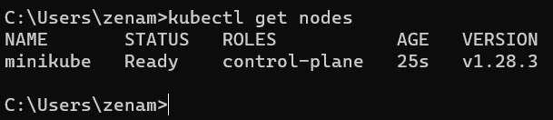
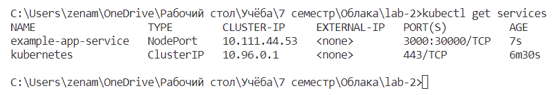
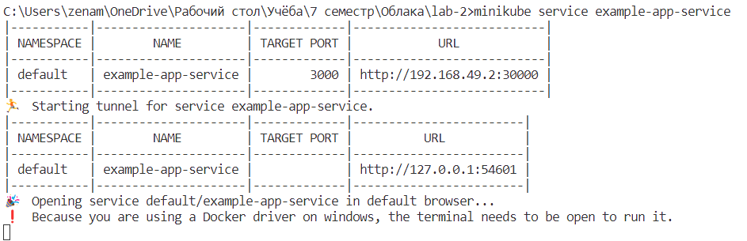
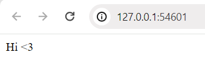

# Лабораторная работа №2. Kubernetes

## Цель работы

Поднять кластер Kubernetes локально, в нём развернуть свой сервис.

## Ход работы

Для выполнения работы был использован [Minikube](https://minikube.sigs.k8s.io/docs/), который позволяет поднять локальный кластер Kubernetes.
После установки Minikube, запустим кластер с помощью команды `minikube start`. Проверим, что кластер запустился с помощью команды `kubectl get nodes`:

<p align="center">
    
</p>

Создадим yaml-файл с Deployment'ом и Service'ом для нашего приложения:

```yaml
apiVersion: apps/v1
kind: Deployment
metadata:
  name: example-app-deployment
  labels:
    app: example-app
spec:
  replicas: 1
  selector:
    matchLabels:
      app: example-app
  template:
    metadata:
      labels:
        app: example-app
    spec:
      containers:
        - name: example-app
          image: duglas431/example-app:1.0
          resources:
            limits:
              memory: "1024Mi"
              cpu: "500Mi"
          ports:
            - containerPort: 3000
---
apiVersion: v1
kind: Service
metadata:
  name: example-app-service
spec:
  type: NodePort
  selector:
    app: example-app
  ports:
    - protocol: TCP
      port: 3000
      targetPort: 3000
      nodePort: 30000
```

Описание Deployment'а:

- `replicas: 1` - количество реплик нашего приложения
- `selector` - селектор, по которому Kubernetes будет искать поды, которые нужно масштабировать
- `template` - шаблон пода, который будет создан при масштабировании
- `containers` - список контейнеров, которые будут запущены в поде
- `name` - имя контейнера
- `image` - образ, который будет запущен в контейнере. В данном случае, это образ нашего приложения. Ранее он был загружен в Docker Hub.
- `resources` - ограничения по ресурсам для контейнера. В данном случае, контейнеру доступно 1Гб памяти и 500Мб CPU.
- `ports` - список портов, которые будут открыты в контейнере

Описание Service'а:

- `type: NodePort` - тип сервиса. NodePort позволяет открыть порт на каждой ноде кластера
- `selector` - селектор, по которому Kubernetes будет искать поды, которые нужно балансировать
- `ports` - список портов, которые будут открыты в сервисе
- `nodePort` - порт, который будет открыт на каждой ноде кластера
- `targetPort` - порт, на который будет перенаправлен трафик
- `port` - порт, который будет открыт в сервисе
- `protocol` - протокол, по которому будет работать сервис

Применим наш файл с помощью команды `kubectl apply -f example-app.yaml`. Проверим, что наш сервис запустился с помощью команды `kubectl get services`:

<p align="center">
    
</p>

Для того, чтобы получить доступ к нашему сервису выполняем команду `minikube service example-app-service`. Откроется браузер с нашим приложением:

<p align="center">
    
    
</p>

## Вывод

В результате выполнения лабораторной работы был поднят кластер Kubernetes локально, в нём был развернут свой сервис.
