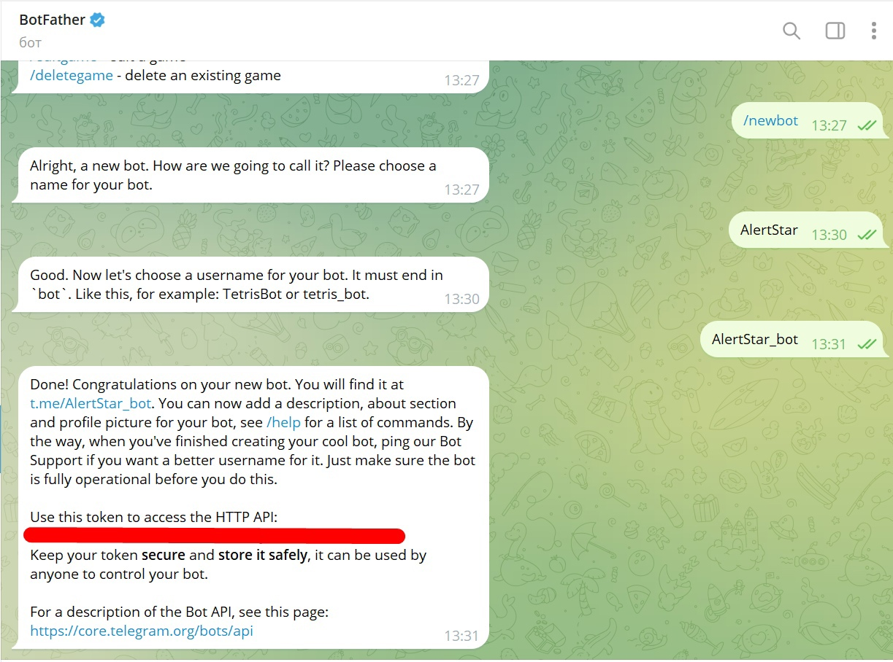
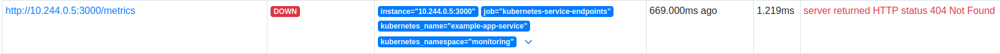
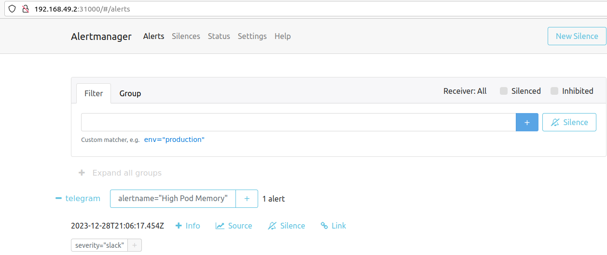
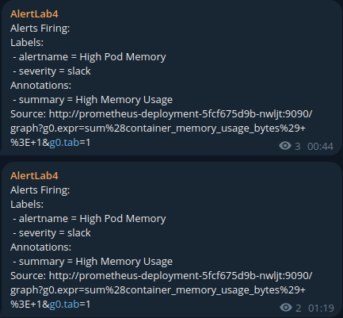

# Лабораторная работа №4* "Создание мониторинг сервиса с помощью Prometheus и Grafana"
## Цель
Настроить отправку уведомлений в телеграм-канал через Alertmanager, развернтутый в Kubernetes.
## Задачи
1. Конфигурация и запуск сервисов приложения и мониторинга.
2. Конфигарция и запуск сервиса отправки уведомлений.
3. Проверка работы сервиса отправки уведомлений.
## Ход работы
### Конфигурация сервисов приложения и мониторинга.
В качестве приложения использовался Node.js сервер из [Лаборатрной работы №1](https://github.com/IVladimirA/itmo-cloud-systems-and-services/tree/master/lab-1). Содержимое конфигурационных файлов было скопировано из [Лабораторной работы №4](https://github.com/IVladimirA/itmo-cloud-systems-and-services/tree/master/lab-4) и представлено в директории `example-app`.

Развертывание сервиса Prometheus выполнялось в соотвествии с [руководством](https://devopscube.com/setup-prometheus-monitoring-on-kubernetes/). Конфигурационный файлы были скопированы с небольшими изменениями. Для работы с Prometheus был создан файл `monitoring/prometheus-service.yaml`, описывающий сервис.
```
$ kubectl get services --namespace=monitoring
NAME                  TYPE       CLUSTER-IP      EXTERNAL-IP   PORT(S)          AGE
example-app-service   NodePort   10.97.52.192    <none>        3000:30002/TCP   123m
prometheus-service    NodePort   10.97.112.124   <none>        8080:30001/TCP   133m
$ kubectl get nodes -o wide
NAME       STATUS   ROLES           AGE     VERSION   INTERNAL-IP    EXTERNAL-IP   OS-IMAGE             KERNEL-VERSION      CONTAINER-RUNTIME
minikube   Ready    control-plane   3h14m   v1.28.3   192.168.49.2   <none>        Ubuntu 22.04.3 LTS   5.15.0-91-generic   docker://24.0.7
$ curl 192.168.49.2:30002
Hi <3
```

<p align="center">
    
    
</p>

### Конфигарция сервиса отправки уведомлений.
Для настройки сервис оповещений был использован [репозиторий](https://github.com/bibinwilson/kubernetes-alert-manager) с созданными файлами. Для отправки уведомлений был частично изменен файл `alerting/config-map.yaml`:
```
route:
  receiver: telegram
  group_by: ['alertname', 'priority']
  group_wait: 10s
  repeat_interval: 30m
  routes:
    - receiver: telegram
      match:
        severity: alert
      group_wait: 10s
      repeat_interval: 1m

receivers:
- name: telegram
  telegram_configs:
  - bot_token: <BOT_TOKEN_CENSORED>
    api_url: https://api.telegram.org
    chat_id: <CHAD_ID_CENSORED>
    parse_mode: ''
```

<p align="center">
    
</p>

### Проверка работы сервиса отправки уведомлений.
Для проверки работы была вполнена отправка стандартного уведомления. Уведомление отобразилось в телеграм-канале, сервси оповещений сработал корректно.

<p align="center">
    
</p>

## Вывод
Цель достигнута: в Kubernetes настроен сервис отправки уведомлений в телеграм-канал.

Конфиграционные файлы элементов Kubernetes позволяют гибко настраивать сервисы мониторинга и оповещения. Помимо телеграм-каналов Alertmanager поддерживает разнообразные виды каналов отправки: электронную почту, slack и другие. Существует возможность фильтрации сообщений по уровню значимости.