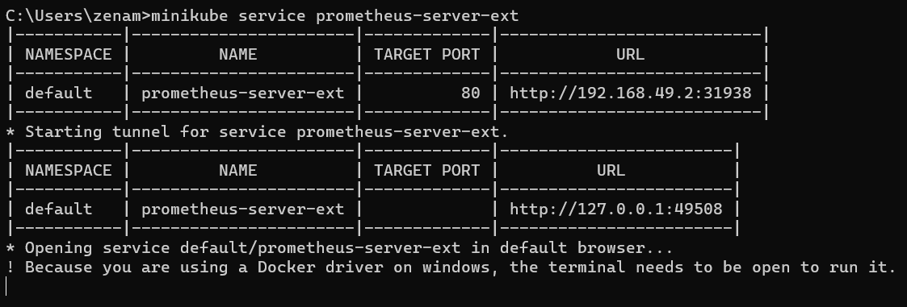
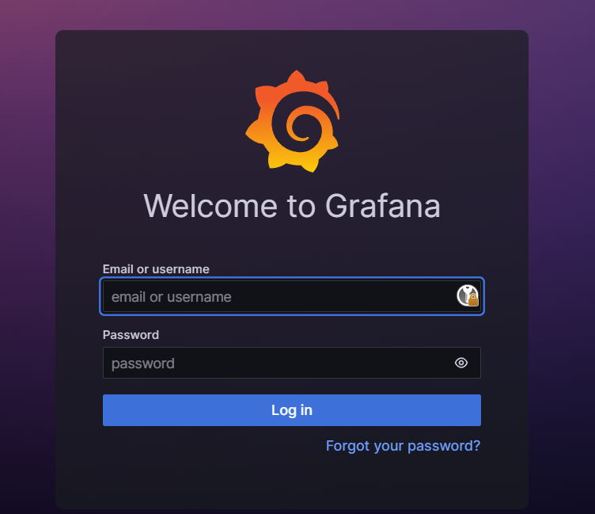

# Лабораторная работа №4. Создание мониторинг сервиса с помощью Prometheus и Grafana

## Цель работы

Создать мониторинг сервис для класстера Kubernetes с помощью Prometheus и Grafana.

## Ход работы

### Настройка Prometheus

Для начала установим Helm. Helm - это пакетный менеджер для Kubernetes. Он упрощает процесс установки и управления приложениями в Kubernetes. Для установки скачаем бинарные файлы с [официального сайта](https://helm.sh/docs/intro/install/) и определим переменную окружения PATH.

Далее запустим наш Kubernetes кластер с помощью minikube и установим Prometheus с помощью команд `helm repo add prometheus-community https://prometheus-community.github.io/helm-charts` и `helm install prometheus prometheus-community/prometheus`

<p align="center">
    
</p>

По итогу мы получили следующие ресурсы:

<p align="center">
    
</p>

Мы будем использовать `prometheus-server` для доступа к приложению Prometheus. `prometheus-server` имеет тип ClusterIP. Для того, чтобы дать доступ к нему снаружи кластера, создадим Service с типом NodePort. Для этого выполим следующую команду:

```bash
kubectl expose service prometheus-server --type=NodePort --target-port=9090 --name=prometheus-server-ext
```

После этого можно получить доступ к приложению Prometheus с помощью команды `minikube service prometheus-server-ext`

<p align="center">
    
    
</p>

### Настройка Grafana

Установим Grafana с помощью команд `helm repo add grafana https://grafana.github.io/helm-charts` и `helm install grafana grafana/grafana`.

<p align="center">
    
</p>

Также, как и в случае с Prometheus, мы будем использовать `grafana` для доступа к приложению Grafana. `grafana` имеет тип ClusterIP. Для того, чтобы дать доступ к нему снаружи кластера, создадим Service с типом NodePort. Для этого выполим следующую команду:

```bash
kubectl expose service grafana --type=NodePort --target-port=3000 --name=grafana-ext
```

После этого можно получить доступ к приложению Grafana с помощью команды `minikube service grafana-ext`

<p align="center">
    
    
</p>

Далее получим предустановленный пароль с помощью команды `kubectl get secret --namespace default grafana -o jsonpath="{.data.admin-password}" | base64 --decode ; echo`

Войдем в Grafana с помощью логина `admin` и полученного пароля.

<p align="center">
    
</p>

Добавим источник данных Prometheus. Для этого перейдем в раздел Configuration -> Data Sources -> Add data source -> Prometheus. В поле URL введем URL, полученный ранее при запуске Prometheus. В нашем случае это http://192.168.49.2:31938.

<p align="center">
    
</p>

Далее создадим новый Dashboard на основе шаблона Kubernetes cluster monitoring (via Prometheus). Для этого перейдем в раздел Create -> Import и в поле Grafana.com Dashboard введем ID шаблона 315, а в качестве источника данных выберем Prometheus.

<p align="center">
    
</p>

По итогу получим следующий Dashboard:

<p align="center">
    
</p>

## Вывод

В результате выполнения работы был создан мониторинг сервис для класстера Kubernetes с помощью Prometheus и Grafana.
